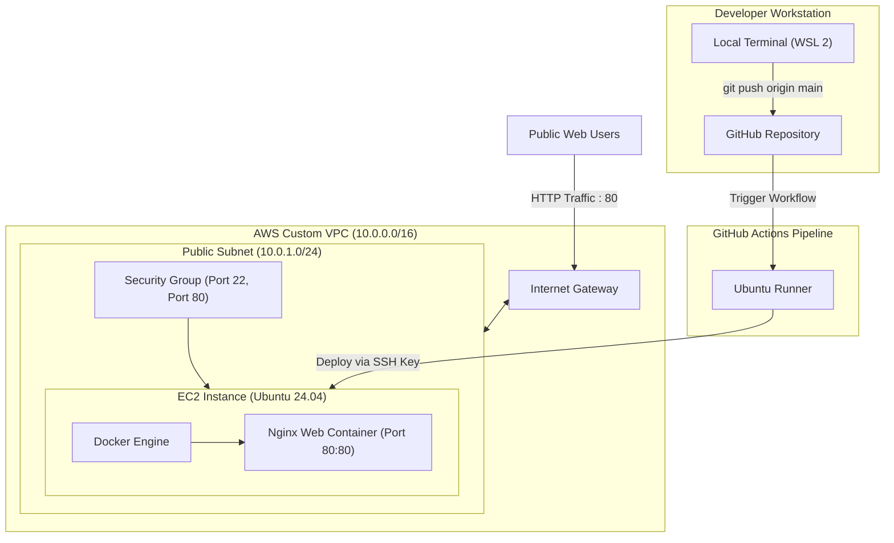

# 🔒 Secure VPC Docker Deployment with Automated CI/CD

An end-to-end cloud infrastructure and DevOps automation project. This project demonstrates deploying a containerized web application on an **AWS EC2** instance inside an isolated **Custom Amazon VPC**, fully automated using a **GitHub Actions CI/CD Pipeline**.

---

## 📌 Architecture Overview 

                               
Key Features

Custom VPC Networking: Designed an isolated VPC network with public subnets, an Internet Gateway (IGW), and dedicated route tables instead of relying on the default AWS VPC.

Granular Network Security: Configured AWS Security Groups with least-privilege principles (restricted SSH on Port 22 and HTTP on Port 80).

Containerization: Packaged a responsive dashboard application into a lightweight, isolated Docker container using Nginx.

Automated CI/CD: Zero-touch deployment using GitHub Actions. Pushing changes to the main branch automatically connects to the server via SSH, pulls latest commits, rebuilds Docker images, and handles container lifecycle.

Self-Healing Deployment Script: Integrated automated dependency verification (auto-installs Docker and Git if missing) and instant health checks (curl -I http://localhost:80).                     
Domain	Technologies Used
Cloud Provider: AWS (VPC, EC2, Internet Gateway, Route Tables, Security Groups)
Containerization: Docker, Nginx (Alpine-based)
CI/CD & Automation:	GitHub Actions, YAML, Bash Scripting
Operating System:	Ubuntu 24.04 LTS / WSL 2
Frontend:	HTML5, CSS3, JavaScript

secure-vpc-docker-deployment-project/

├── .github/
│   └── workflows/
│       └── deploy.yml        # GitHub Actions CI/CD pipeline
├── Dockerfile                # Docker container build instructions
├── index.html                # Application landing dashboard
├── style.css                 # UI styling
├── script.js                 # Frontend dynamics
└── README.md                 # Project documentation

The deployment pipeline is defined in .github/workflows/deploy.yml and executes the following steps on every push:

Trigger: Listens for code pushes to the main branch.

SSH Authentication: Establishes an encrypted SSH handshake with the EC2 instance using stored GitHub Secrets (EC2_HOST, EC2_SSH_KEY).

Environment Provisioning: Automatically checks for Docker runtime on the host and provisions it if not present.

Code Synchronization: Clones or pulls the latest repository code directly into the workspace.

Container Lifecycle Management:

Builds the updated Docker image locally on the instance.

Gracefully stops and removes previous container instances.

Runs the new container mapped to Port 80 with restart policies enabled (--restart unless-stopped).

Health Check: Runs an HTTP verification check to ensure the service returns 200 OK.

🔐 Configuration & Secrets Setup
To replicate this deployment, configure the following secrets under Settings > Secrets and variables > Actions:

EC2_HOST: Public IPv4 address of your AWS EC2 instance.

EC2_SSH_KEY: Content of your private SSH key (.pem file).
